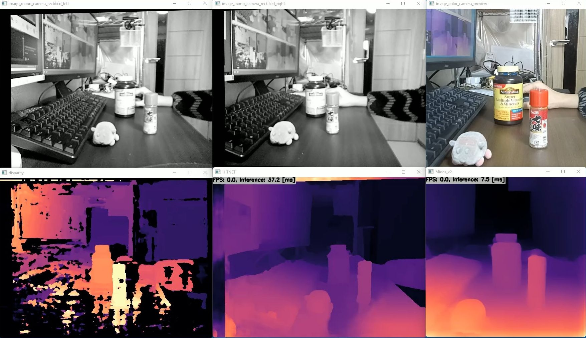

https://user-images.githubusercontent.com/11009876/154006646-262cb61b-6a58-4559-a08e-c3ba5d9f6ddc.mp4

# Depth by OAK-D-LITE and TensorRT
- Disparity detected by DepthAI
- DL Depth Estimation using Mono image: MiDaS v2.1
- DL Depth Estimation using Stereo images: HITNET (Middlebury)

## How to Run
1. Please follow the instruction: https://github.com/iwatake2222/play_with_depthai/blob/master/README.md
2. Additional steps:
    - Download model (MiDaS v2.1)
        - from: https://github.com/isl-org/MiDaS/releases/download/v2_1/model-f6b98070.onnx
        - to: `resource/mdoel/midasv2_384x384.onnx`
    - Download model (HITNET)
        - https://github.com/PINTO0309/PINTO_model_zoo/blob/main/142_HITNET/download.sh
        - copy `middlebury_d400/saved_model_480x640/model_float32_opt.onnx` to `resource/model/hitnet_middlebury_d400_480x640.onnx`
    - Build  `pj_depthai_depth_by_tensorrt` project (this directory)

## Acknowledgements
- https://github.com/PINTO0309/PINTO_model_zoo
- https://github.com/isl-org/MiDaS
- https://github.com/google-research/google-research/tree/master/hitnet
